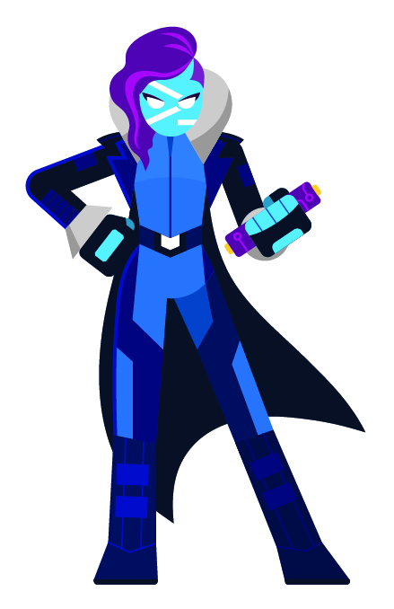

### Hi there 👋

- 🔭 I’m currently working on [FluentRegex](https://github.com/rbleattler/FluentRegex), a library for building regular expressions following the Builder Pattern
- 🌱 I’m currently learning about Kubertnetes, Azure Development Environments, and DSLs
- 👯 I’m looking to collaborate on lots of things! Shoot me a message here or on any social platform and I'll get back to you ASAP!
- 💬 Ask me about [PowerShell](https://learn.microsoft.com/en-us/powershell/scripting/overview?view=powershell-7.4) 
- 📫 How to reach me: A little bit of OSINT never hurt anyone 😉
- 😄 Pronouns: He/Him/Who?
- ⚡ Fun fact: The collective noun for goldfish is a "Troubling" -- how strange. [WikiPedia](https://en.wiktionary.org/wiki/Appendix:Glossary_of_collective_nouns_by_collective_term#T)

